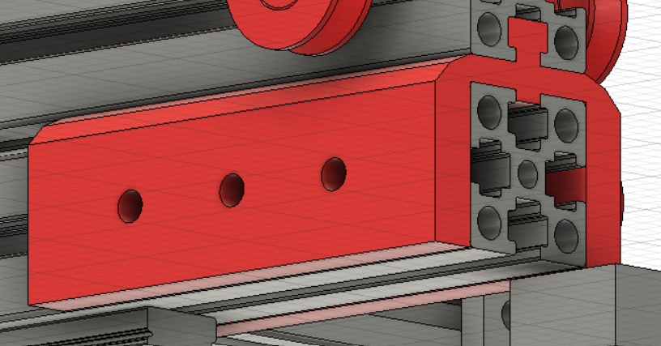

# SAZANKA_2023_parts

頑張って印刷しよう

| パーツ名      | 必要数 | 在庫数 | イメージ                           |
| ------------- | ------ | ------ | ---------------------------------- |
| stopper1      | 6      | 2      |   |
| stopper2      | 4      | 1      |   |
| slide1      | 12      | 0      |   |
| slide2      | 2      | 0     |   ひっかかりのとこはinfill100% |
| fixture      | 8      | 0      |   |
| receiving_shaft    | 4      | 0      |  infill100%？？ |
| rotation      | 2      | 0     |   infill100% |
| axis     | 2      | 0      |   |
|mini_receiving   | 4      | 0      |   |
| mini_rotation     | 2      | 0      |   |
|pulley   | 20      | 0      |   |
| arm_fixture    | 2      | 0      |   |
|arm_fastener   | 4      | 0      |   |
|arm_rolling   | 2      | 0      |   |

